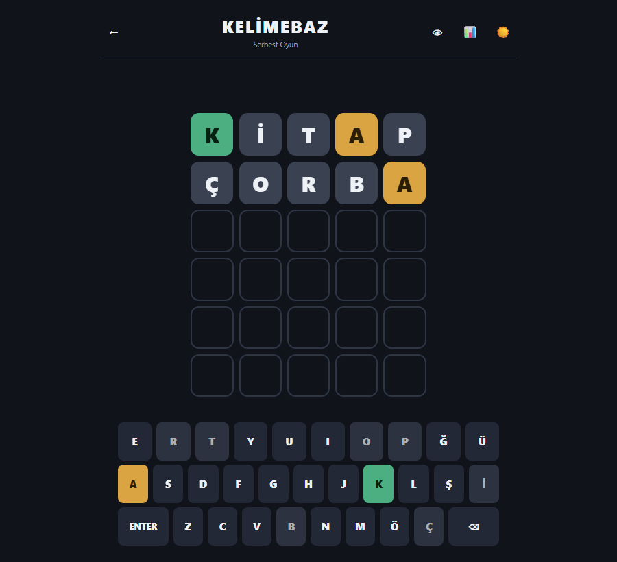
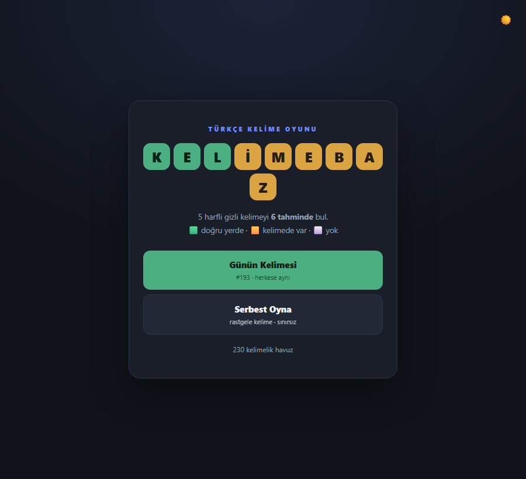
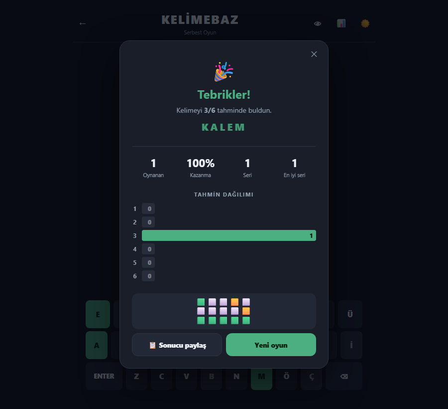
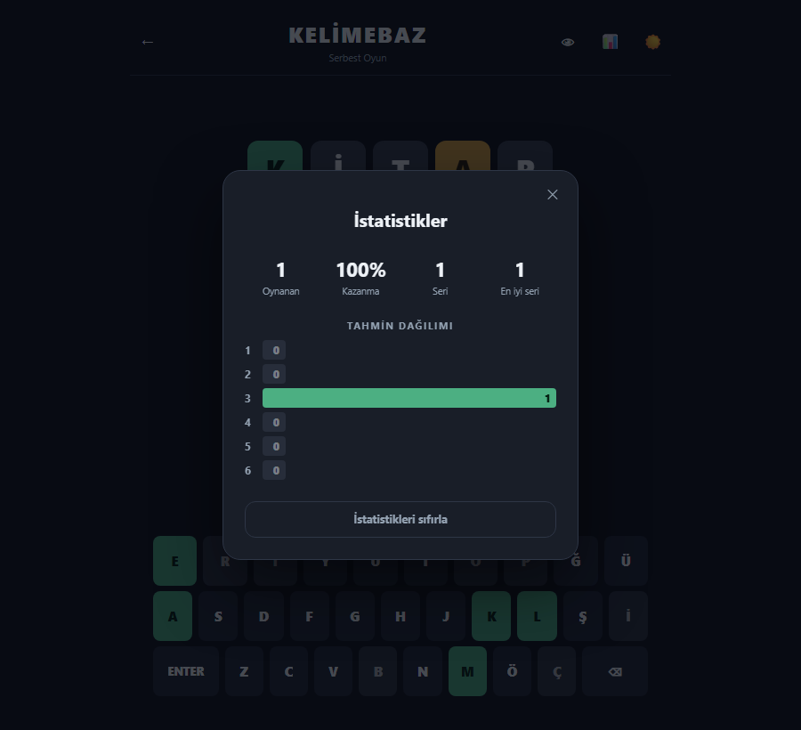
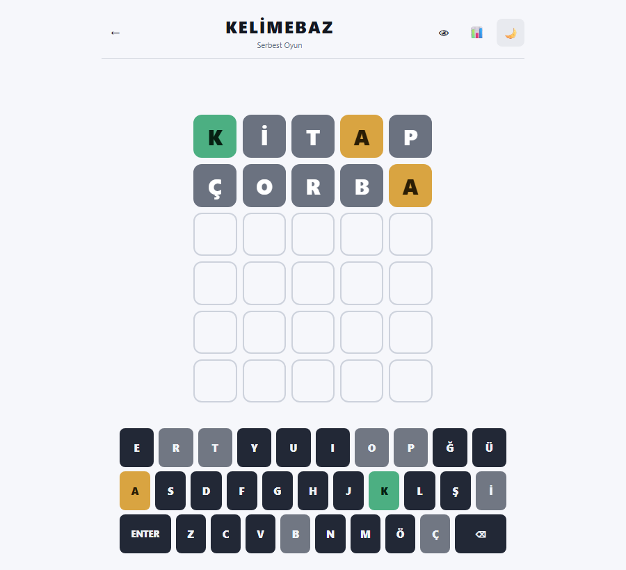
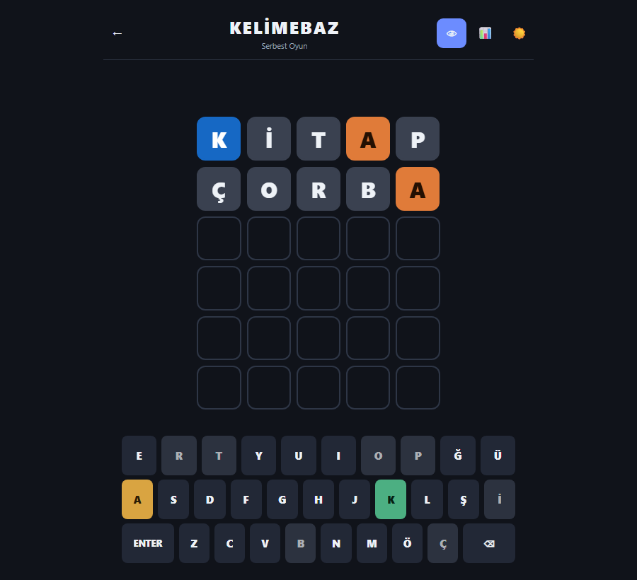
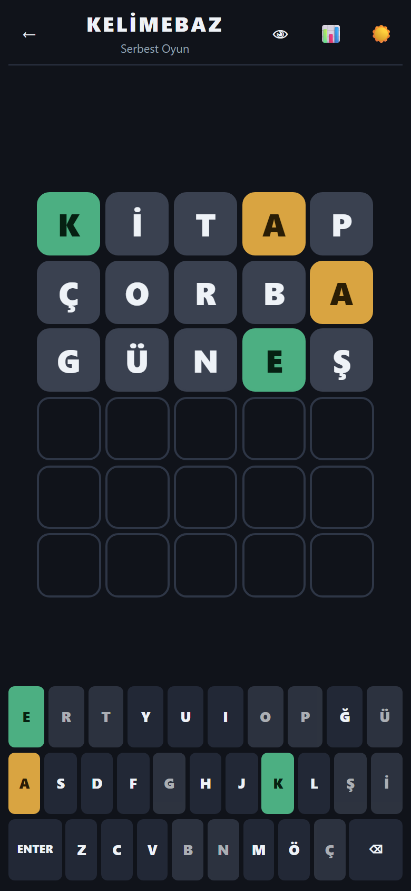

<div align="center">

# 🎯 Kelimebaz

**Türkçe kelime bulmaca oyunu.** 5 harfli gizli kelimeyi 6 tahminde bul.

### ▶️ [**Oyna: 34.158.136.9/berk/kelimebaz**](http://34.158.136.9/berk/kelimebaz/)



</div>

---

## Nasıl oynanır

Gizli kelimeyi tahmin et. Her tahminden sonra harfler renklenir:

| | Anlamı |
| --- | --- |
| 🟩 **Yeşil** | Harf doğru ve **doğru konumda** |
| 🟨 **Sarı** | Harf kelimede **var** ama yeri yanlış |
| ⬜ **Gri** | Harf kelimede **hiç yok** |

**6 hakkın var.** Bitmeden bulursan kazanırsın; bulamazsan doğru kelime gösterilir.

**İki mod:**
- **Günün Kelimesi** — herkes aynı kelimeyi oynar, her gün yenilenir, günde bir hak
- **Serbest Oyna** — rastgele kelime, sınırsız

---

## Ekran görüntüleri

| Başlık ekranı | Kazanma |
| --- | --- |
|  |  |

| İstatistikler | Aydınlık tema |
| --- | --- |
|  |  |

| Renk körü modu | Mobil |
| --- | --- |
|  |  |

---

## Özellikler

- 🎯 **Doğru renk mantığı** — harf tekrarlarında bile (Wordle klonlarının en sık hata yaptığı yer)
- ⌨️ **Türkçe klavye** — 29 harf, `İ`/`I` ayrımı doğru; fiziksel klavye de çalışır
- 📅 **Günün kelimesi** — tarihe göre deterministik, herkese aynı, geri sayımlı
- 📊 **İstatistikler** — oynanan, kazanma %, seri, tahmin dağılımı
- 📋 **Spoiler'sız paylaşım** — 🟩🟨⬜ emoji ızgarası
- 🌙 **Karanlık + aydınlık tema** — sistem tercihine uyar
- 👁 **Renk körü modu** — mavi/turuncu palet
- ♿ **Erişilebilir** — sadece klavyeyle oynanabilir, ekran okuyucu her hamleyi okur
- 📱 **Responsive** — 320px'den 4K'ya
- 💾 **Kalıcı** — yarım oyun, istatistik ve tercihler `localStorage`'da
- 🚫 **Backend yok** — kelime listesi JSON, tamamen istemci tarafı

---

## Kurulum

**Gereksinim:** Node.js 20+

```bash
git clone https://github.com/berk74988-ctrl/kelimebaz.git
cd kelimebaz
npm install

npm start          # geliştirme sunucusu → http://localhost:4200
```

```bash
npm run build      # üretim derlemesi → dist/kelimebaz/browser/
npm test           # birim testler
```

---

## Teknoloji

**Angular 22** — standalone bileşenler (NgModule yok), **signals** ile durum yönetimi, `OnPush`, TypeScript, SCSS.

### Proje yapısı

```
src/app/
├── core/                    # SAF mantık — Angular'a bağımsız, kolay test edilir
│   ├── evaluate.ts          #   renk algoritması (oyunun kalbi)
│   ├── share.ts             #   emoji ızgarası
│   ├── a11y.ts              #   ekran okuyucu metinleri
│   ├── clipboard.ts         #   panoya kopyalama (HTTP yedekli)
│   └── turkish.ts           #   Türkçe büyük harf (i → İ)
├── components/              # standalone bileşenler
│   ├── board/  tile/  keyboard/  toast/
│   ├── game/   title-screen/  error-screen/
│   ├── result-modal/  stats-modal/  stats-panel/  countdown/
├── services/                # durum ve kalıcılık (signals)
│   ├── game.service.ts      #   oyun akışı
│   ├── word.service.ts      #   kelime havuzu, günün kelimesi
│   ├── stats.service.ts     #   istatistikler
│   ├── theme.service.ts     #   koyu/açık tema
│   └── contrast.service.ts  #   renk körü modu
├── models/                  # TypeScript tipleri
└── data/words.json          # kelime havuzu (205 kelime)
```

### Mimari notlar

**Renk mantığı `core/`'da, Angular'dan tamamen bağımsız.** İki geçişli algoritma:

1. Önce **tam isabetler** (🟩) işaretlenir ve o harfler cevabın havuzundan **düşülür**
2. Kalan harfler için havuzda hâlâ varsa 🟨, yoksa ⬜

Bu sıra sayesinde bir harf **asla iki kez sayılmaz**. Örnek — cevap `KALEM`, tahmin `ARABA`: tahminde 3 A var ama cevapta 1 A → **sadece biri** sarı olur.

**Renkler iki katmanlı:** `_variables.scss` (SCSS, derleme zamanı) → `:root` CSS değişkenleri (çalışma zamanı). Tema ve renk körü modu tek satır değişimiyle geçiş yapar — hiçbir bileşen yeniden çizilmez.

---

## Test

```bash
npm test                     # 159 birim test
npm run check:scenarios      # 22 uçtan uca senaryo × 3 tarayıcı
npm run check:responsive     # 8 ekran boyutu
npm run check:a11y           # klavye + ekran okuyucu + odak
npm run check:contrast       # WCAG kontrast (4 mod)
npm run check:share          # panoya kopyalama
```

Tüm kontroller hem yerelde hem **canlı sitede** çalıştırılıyor. Ayrıntılı checklist ve bulunan hatalar: **[TESTING.md](TESTING.md)**

| Katman | Sonuç |
| --- | --- |
| Birim testler | ✅ 159/159 |
| Senaryolar (Chromium + Firefox + WebKit) | ✅ 66/66 |
| Responsive · Erişilebilirlik · Kontrast · Paylaşım | ✅ |

---

## Deploy

Üretim derlemesi statik dosyalardan ibaret — herhangi bir statik barındırmaya konabilir.

```bash
npm run build
# dist/kelimebaz/browser/ içeriğini sunucuya kopyala
```

Alt klasöre kuruluyorsa `base-href` gerekir. Bu proje `/berk/kelimebaz/` altında yayında, bu yüzden `angular.json`'ın **production** yapılandırmasına gömülü:

```json
"baseHref": "/berk/kelimebaz/"
```

Böylece düz `ng build` her zaman doğru yolu üretir.

---

## Yol haritası

- [x] Oyun tahtası, Türkçe klavye, renk mantığı
- [x] Kazanma / kaybetme, geçersiz kelime uyarıları
- [x] Animasyonlar, responsive, karanlık mod
- [x] İstatistikler, günün kelimesi, paylaşım
- [x] Erişilebilirlik ve renk körü modu
- [x] Uçtan uca test takımı, canlı deploy
- [ ] Kelime havuzunu genişlet (şu an 205)
- [ ] HTTPS (özel alan adı)
