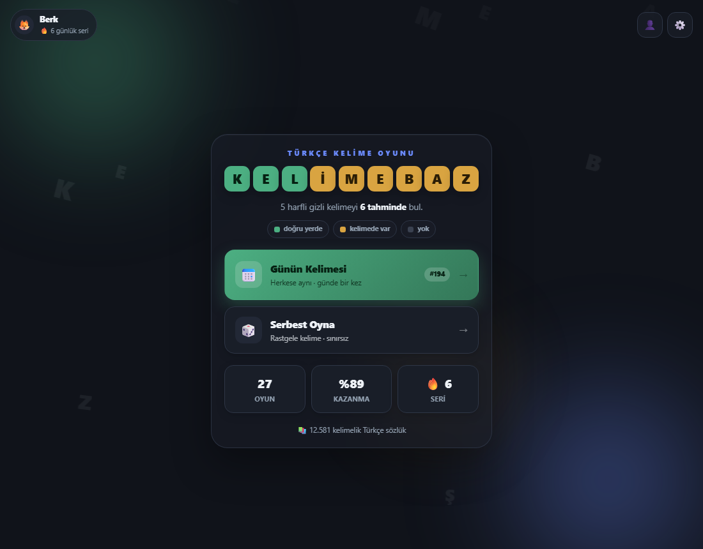
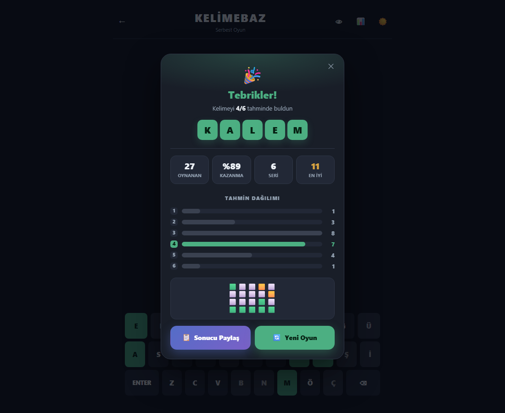
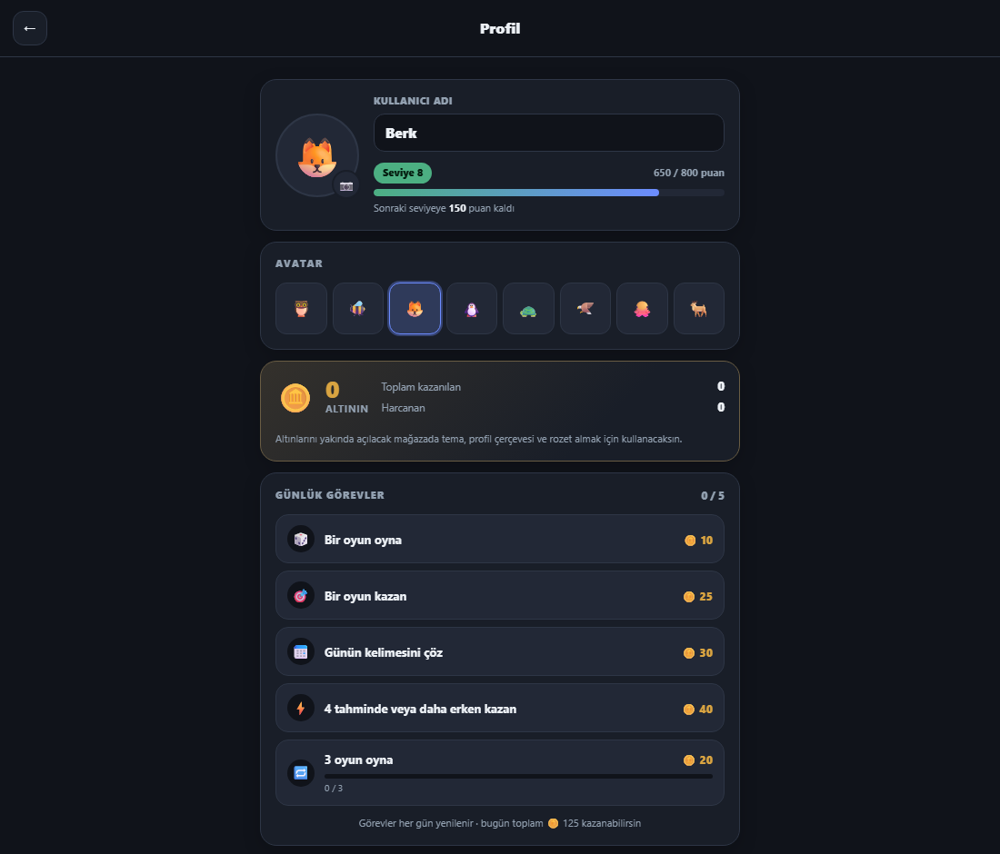
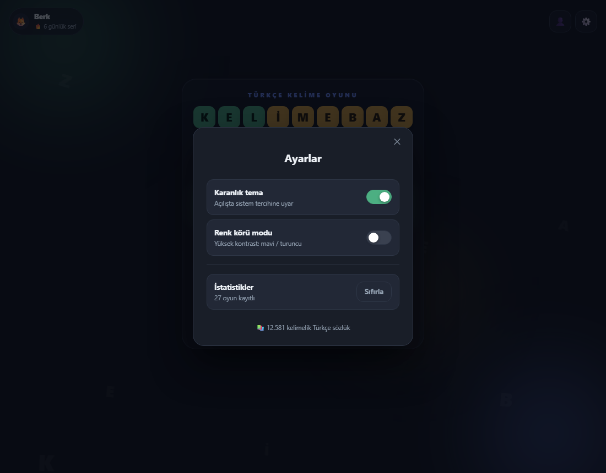
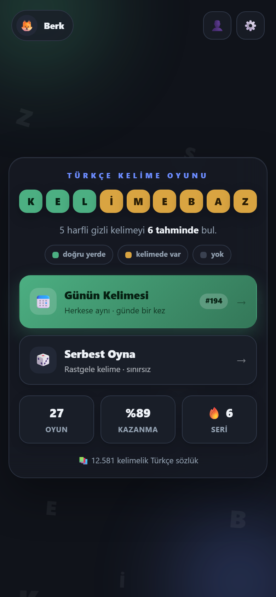

<div align="center">

# 🎯 Kelimebaz

**Türkçe kelime bulmaca oyunu.** 5 harfli gizli kelimeyi 6 tahminde bul.

### ▶️ [**Oyna: 34.158.136.9/berk/kelimebaz**](http://34.158.136.9/berk/kelimebaz/)


</div>

---

## Nasıl oynanır

Gizli kelimeyi tahmin et. Her tahminden sonra harfler renklenir:

| | Anlamı |
| --- | --- |
| 🟩 **Yeşil** | Harf doğru ve **doğru konumda** |
| 🟨 **Sarı** | Harf kelimede **var** ama yeri yanlış |
| ⬜ **Gri** | Harf kelimede **hiç yok** |

**6 hakkın var.** Bitmeden bulursan kazanırsın; bulamazsan doğru kelime gösterilir.

**İki mod:**
- **Günün Kelimesi** — herkes aynı kelimeyi oynar, her gün yenilenir, günde bir hak
- **Serbest Oyna** — rastgele kelime, sınırsız

---

## Ekran görüntüleri

| Ana menü | Oyun sonu |
| --- | --- |
|  |  |

| Profil sayfası | Ayarlar |
| --- | --- |
|  |  |

| Renk körü modu | Mobil |
| --- | --- |
|  |  |

---

## Özellikler

- 📚 **14.000+ kelimelik Türkçe sözlük** — çekimli biçimler dâhil (`GELDİ`, `OLSUN`, `ÜTÜYE`)
- 🎯 **Doğru renk mantığı** — harf tekrarlarında bile (Wordle klonlarının en sık hata yaptığı yer)
- ⌨️ **Tam Türk alfabesi** — 29 harf; `İ`/`I` ayrımı doğru. Türkçe klavyesi olmayanlar da `Ç Ğ Ö Ş Ü` yazabilir
- 📅 **Günün kelimesi** — tarihe göre deterministik, herkese aynı, geri sayımlı
- 📊 **İstatistikler** — oynanan, kazanma %, seri, tahmin dağılımı
- 🪙 **Altın** — oyun kazandıkça ve günlük görevleri bitirdikçe birikir
- 🛒 **Mağaza** — altınla tema, profil çerçevesi, rozet ve avatar satın alınır; kalıcı, istenince kullanılıp geri çıkarılır
- 📋 **Günlük görevler** — her gün yenilenir, tamamlayınca altın kazandırır
- 👤 **Profil sayfası** — fotoğraf, ad, **seviye**, puan, altın, bulunan kelime, seriler, tahmin dağılımı (tamamen yerel, hesap yok)
- 🎵 **Ses** — arka plan müziği + oyun içi efektler, **ayrı ayrı** ayarlanabilir ve kaydedilir
- ⚙️ **Ayarlar** — ses, tema, renk körü modu, veri sıfırlama
- 📋 **Spoiler'sız paylaşım** — 🟩🟨⬜ emoji ızgarası
- 🌙 **Karanlık + aydınlık tema** — sistem tercihine uyar
- 👁 **Renk körü modu** — mavi/turuncu palet
- ♿ **Erişilebilir** — sadece klavyeyle oynanabilir, ekran okuyucu her hamleyi okur
- 📱 **Responsive** — 320px'den 4K'ya
- 💾 **Kalıcı** — yarım oyun, istatistik ve tercihler `localStorage`'da
- 🚫 **Backend yok** — kelime listesi JSON, tamamen istemci tarafı

---

## Kurulum

**Gereksinim:** Node.js 20+

```bash
git clone https://github.com/berk74988-ctrl/kelimebaz.git
cd kelimebaz
npm install

npm start          # geliştirme sunucusu → http://localhost:4200
```

```bash
npm run build      # üretim derlemesi → dist/kelimebaz/browser/
npm test           # birim testler
```

---

## Teknoloji

**Angular 22** — standalone bileşenler (NgModule yok), **signals** ile durum yönetimi, `OnPush`, TypeScript, SCSS.

### Proje yapısı

```
src/app/
├── core/                    # SAF mantık — Angular'a bağımsız, kolay test edilir
│   ├── evaluate.ts          #   renk algoritması (oyunun kalbi)
│   ├── share.ts             #   emoji ızgarası
│   ├── a11y.ts              #   ekran okuyucu metinleri
│   ├── clipboard.ts         #   panoya kopyalama (HTTP yedekli)
│   └── turkish.ts           #   Türkçe büyük harf (i → İ)
├── components/              # standalone bileşenler
│   ├── board/  tile/  keyboard/  toast/
│   ├── game/   title-screen/  error-screen/
│   ├── result-modal/  stats-modal/  stats-panel/  countdown/
├── services/                # durum ve kalıcılık (signals)
│   ├── game.service.ts      #   oyun akışı
│   ├── word.service.ts      #   kelime havuzu, günün kelimesi
│   ├── stats.service.ts     #   istatistikler
│   ├── theme.service.ts     #   koyu/açık tema
│   └── contrast.service.ts  #   renk körü modu
├── models/                  # TypeScript tipleri
├── data/
│   ├── words.json           # CEVAPLAR — elle seçilmiş 230 kelime
│   └── valid-words.json     # GEÇERLİ TAHMİNLER — 14.251 kelime
```

### Mimari notlar

**Sözlük üç katmandan üretilir** (`scripts/build-dictionary.mjs`) — kelime **uydurulmaz**, hepsi ya insan eliyle yazılmış bir sözlükten gelir ya da gerçek metinde kanıtlanmıştır:

1. **Sözlük katmanı** — TDK tabanlı listeler + Zemberek + Hunspell + eş anlamlılar
2. **Vikisözlük katmanı** — madde başları (koşulsuz) + resmî çekim tabloları (sınanarak)
3. **Korpus katmanı** — OpenSubtitles frekans listesi, biçimbilim süzgecinden geçirilmiş

Üçüncü katman şart: kök sözlükleri `GEL` içerir ama oyuncu `GELDİ` yazar. Ham korpus ise çöp dolu (`FROST`, `MİKEY`, `ALDİM`), o yüzden süzülür.

`scripts/turkish-morph.mjs` her adayı çözümlemeye çalışır — kelime, bilinen bir kökten geçerli bir ekle, **ünlü uyumuna, sözcük türüne ve ek sırasına uyarak** türetilebiliyor mu?

| Aday | Karar | Neden |
| --- | --- | --- |
| `GELDİ` | ✅ | `GEL`(fiil) + `-di` — uyum doğru |
| `YOKTU` | ✅ | `YOK`(isim) + `-tu` — ek-fiil isme de gelir |
| `ÜTÜYE` | ✅ | Vikisözlük çekim tablosu: `ütü` + yönelme |
| `ALDİM` | ❌ | uyum bozuk (`AL` kalın → `ALDIM` olmalı) |
| `MORAN` | ❌ | `MOR` isim; `-an` yalnızca fiile gelir |
| `ÜVEZM` | ❌ | Vikisözlük şablon hatası (doğrusu `ÜVEZİM`) |
| `PETER` | ❌ | özel ad — Vikisözlük'ün `name` girdileri kara listede |
| `SİMDİ` | ❌ | `ŞİMDİ`nin yazım hatası (tek harf düzeltmesi çok daha sık) |

**Kelime ÜRETMEK denendi ve reddedildi.** Kuralları ileri yönde çalıştırıp her kökten her eki türetmek cazipti, ama isabeti %60-70'te tavan yaptı: kök listelerindeki `AB`, `ÖF`, `PO` gibi sahte parçalardan `ABIYI`, `ÖFSÜZ`, `POMDA` üretiyor; ek-fiil her isme gelebildiği için `JELDİ`, `ÇÖLÜZ` gibi dilbilgisel ama var olmayan kelimeler patlıyordu. Gerekçe `turkish-morph.mjs` içinde kayıtlı.

**Profil istatistikleri bir KAYIT DEFTERİNDEN çizilir** (`core/profile-stats.ts`). Şablonda kart tek tek yazılmaz; yeni bir istatistik eklemek için:

1. Gerekiyorsa `Stats`'a alanı ekle (`models/game.model.ts` + `EMPTY_STATS`)
2. Kayıt defterine bir satır ekle

Bitti — profil sayfası, boş durum ve testler kendiliğinden uyar. Eski kayıtlar göç kodu istemez: `StatsService.load()` eksik alanları varsayılanla tamamlar. Türetilmiş istatistikler (kazanma oranı gibi) `Stats`'ta **alan tutmaz**, kayıt defterinde hesaplanır — aynı sayıyı iki yerde saklamak, ikisinin zamanla ayrışması demektir.

**Puan ve seviye saf fonksiyonlar** (`core/score.ts`, `core/level.ts`). Puan: temel 100 + hız (kalan her hak +20) + seri (×5, en fazla +50). Her seviye bir öncekinden pahalı — `n → n+1` için `100 × n` puan.

**Altın ile puan AYRI para birimleri.** Puan seviye ilerlemesidir, harcanmaz. Altın (`core/gold.ts`) mağaza parasıdır, harcanır. İkisini karıştırmak — altını harcayınca seviyenin düşmesi — saçma olurdu. `GoldService.spend()` yetersiz bakiyede `false` döner ve kasaya dokunmaz; mağaza sadece bunu çağıracak.

**Günlük görevler bir KAYIT DEFTERİNDEN** (`core/quests.ts`) — istatistik kartları gibi. Yeni görev = deftere bir satır. Ödeme bir kez yapılır: tamamlanan görevin kimliği kaydedilir, sayfa yenilense de ikinci kez ödemez. Görevler her gün (oyuncunun yerel günü, günün kelimesiyle aynı ritim) sıfırlanır ama altın kalır.

**Mağaza da bir KAYIT DEFTERİNDEN** (`core/shop-catalog.ts`) — dört kategori (tema, çerçeve, rozet, avatar), her ürün bir satır. `InventoryService` sahipliği ve "kullanımda"yı yönetir; satın alma `GoldService.spend()`'e dayanır (yetersiz altında hiçbir şey değişmez), bir ürün iki kez alınamaz. Satın alınan kalıcıdır ve istenince kullanılıp geri çıkarılır. **Temalar** yalnızca `--accent`/`--accent-2`'yi `<html data-skin>` ile değiştirir; oyun durumu renklerine (WCAG ölçülü) ve paylaş butonuna dokunmaz, yani hiçbir tema okunabilirliği bozamaz. **Avatarlar tek sistem**: eski ücretsiz sekiz emoji de katalogda (fiyat 0), profil sadece envanterden okur.

**Renk mantığı `core/`'da, Angular'dan tamamen bağımsız.** İki geçişli algoritma:

1. Önce **tam isabetler** (🟩) işaretlenir ve o harfler cevabın havuzundan **düşülür**
2. Kalan harfler için havuzda hâlâ varsa 🟨, yoksa ⬜

Bu sıra sayesinde bir harf **asla iki kez sayılmaz**. Örnek — cevap `KALEM`, tahmin `ARABA`: tahminde 3 A var ama cevapta 1 A → **sadece biri** sarı olur.

**Renkler iki katmanlı:** `_variables.scss` (SCSS, derleme zamanı) → `:root` CSS değişkenleri (çalışma zamanı). Tema ve renk körü modu tek satır değişimiyle geçiş yapar — hiçbir bileşen yeniden çizilmez.

---

## Test

```bash
npm test                     # 219 birim test
npm run check:scenarios      # 22 uçtan uca senaryo × 3 tarayıcı
npm run check:profile        # profil sayfası, seviye, fotoğraf, kalıcılık
npm run check:gold           # altın kazancı, günlük görevler, kalıcılık
npm run check:shop           # satın alma, kullanma, tema uygulaması, kalıcılık
npm run check:audio          # müzik, efektler, ses ayarları, kalıcılık
npm run check:dictionary     # 29 harf + sözlük kabul/ret (gerçek tarayıcı)
npm run check:responsive     # 8 ekran boyutu
npm run check:a11y           # klavye + ekran okuyucu + odak
npm run check:contrast       # WCAG kontrast (4 mod)
npm run check:share          # panoya kopyalama
```

Tüm kontroller hem yerelde hem **canlı sitede** çalıştırılıyor. Ayrıntılı checklist ve bulunan hatalar: **[TESTING.md](TESTING.md)**

| Katman | Sonuç |
| --- | --- |
| Birim testler | ✅ 219/219 |
| Senaryolar (Chromium + Firefox + WebKit) | ✅ 66/66 |
| Ses · Harf + sözlük · Responsive · Erişilebilirlik · Kontrast · Paylaşım | ✅ |

---

## Deploy

Üretim derlemesi statik dosyalardan ibaret — herhangi bir statik barındırmaya konabilir.

```bash
npm run build
# dist/kelimebaz/browser/ içeriğini sunucuya kopyala
```

Alt klasöre kuruluyorsa `base-href` gerekir. Bu proje `/berk/kelimebaz/` altında yayında, bu yüzden `angular.json`'ın **production** yapılandırmasına gömülü:

```json
"baseHref": "/berk/kelimebaz/"
```

Böylece düz `ng build` her zaman doğru yolu üretir.

---

## Yol haritası

- [x] Oyun tahtası, Türkçe klavye, renk mantığı
- [x] Kazanma / kaybetme, geçersiz kelime uyarıları
- [x] Animasyonlar, responsive, karanlık mod
- [x] İstatistikler, günün kelimesi, paylaşım
- [x] Erişilebilirlik ve renk körü modu
- [x] Uçtan uca test takımı, canlı deploy
- [x] Sözlüğü genişlet (205 → 5.520 kelime)
- [x] Giriş menüsünü yenile (hareketli arka plan, mod kartları)
- [x] Biçimbilim süzgeci + çekimli biçimler (5.520 → 12.581 kelime)
- [x] Ana menü: cam panel, profil + ayarlar, istatistik kartları
- [x] Oyun sonu ekranı: kart hâlinde istatistikler, okunur dağılım, büyük butonlar
- [x] Ses: arka plan müziği + WebAudio efektleri, ayrı ses ayarları
- [ ] Müzik dosyasını sıkıştır (şu an 4 MB — `ffmpeg` gerekiyor)
- [ ] HTTPS (özel alan adı)
