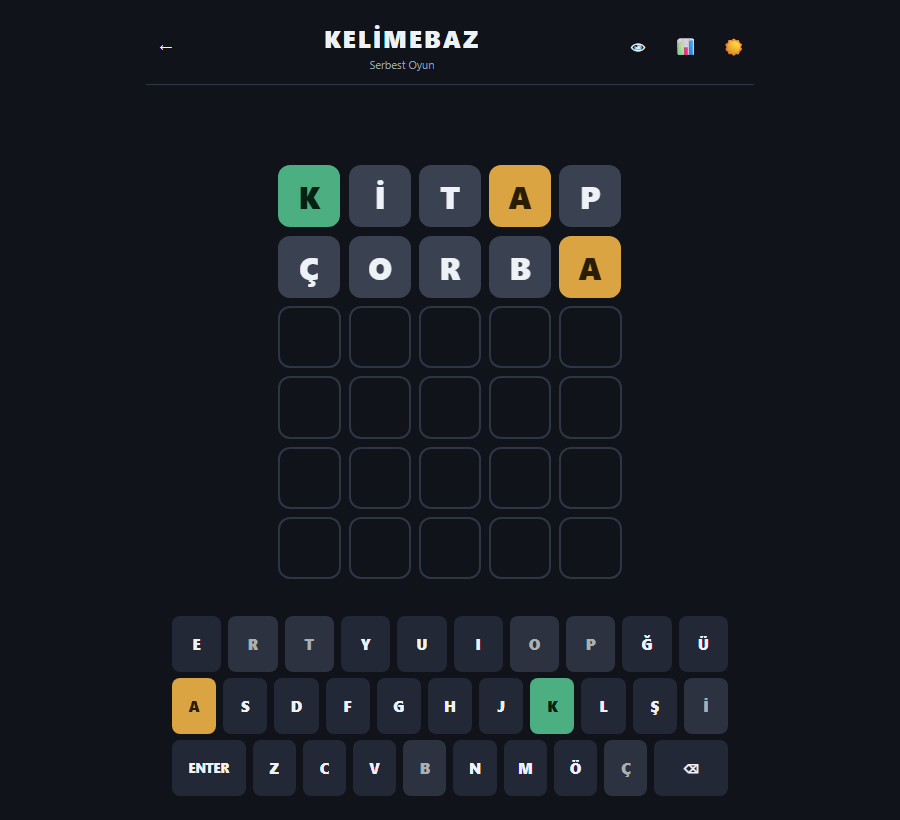
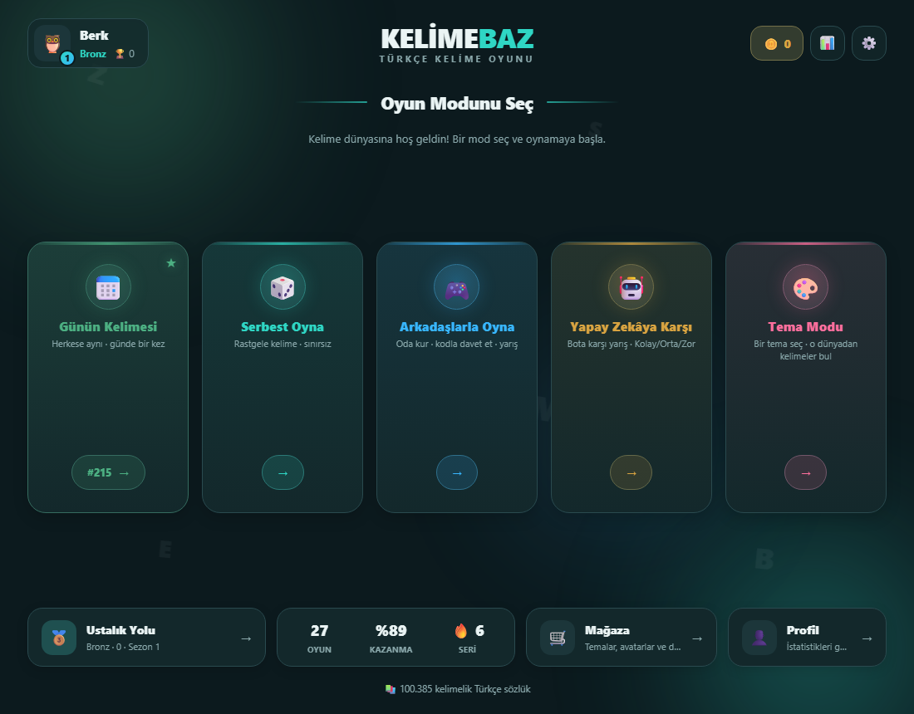
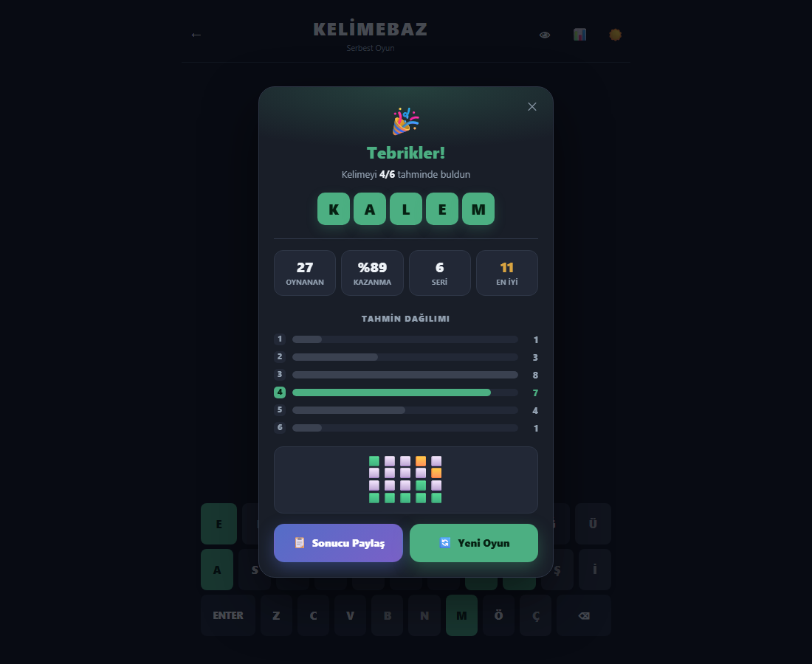
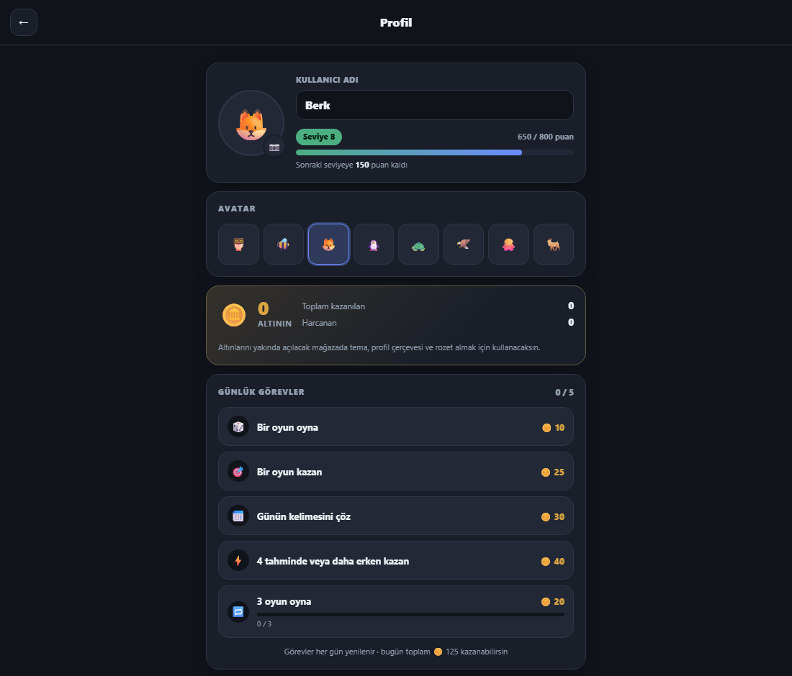
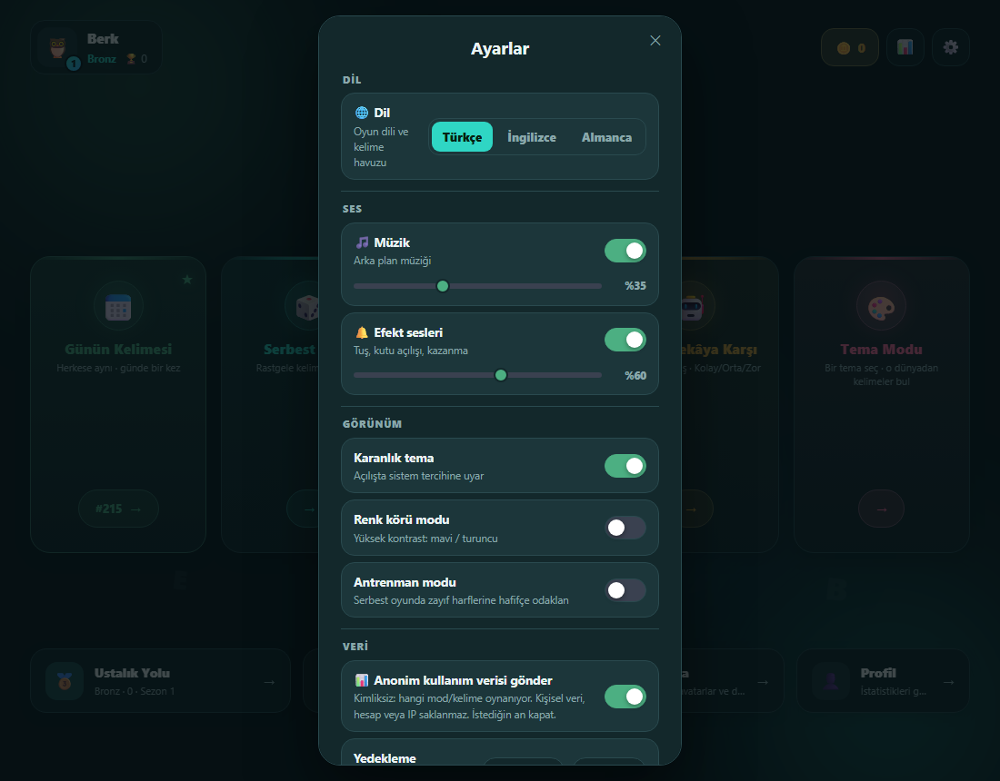
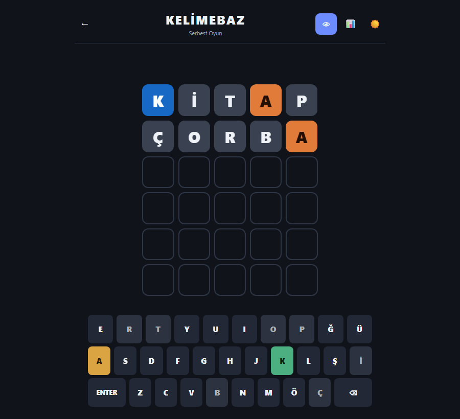
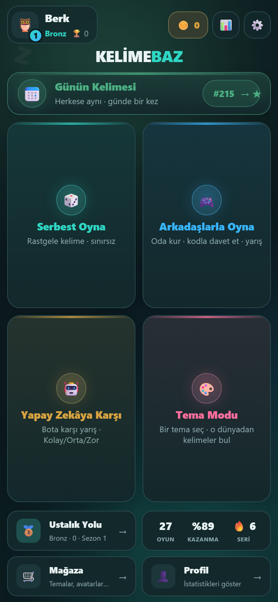
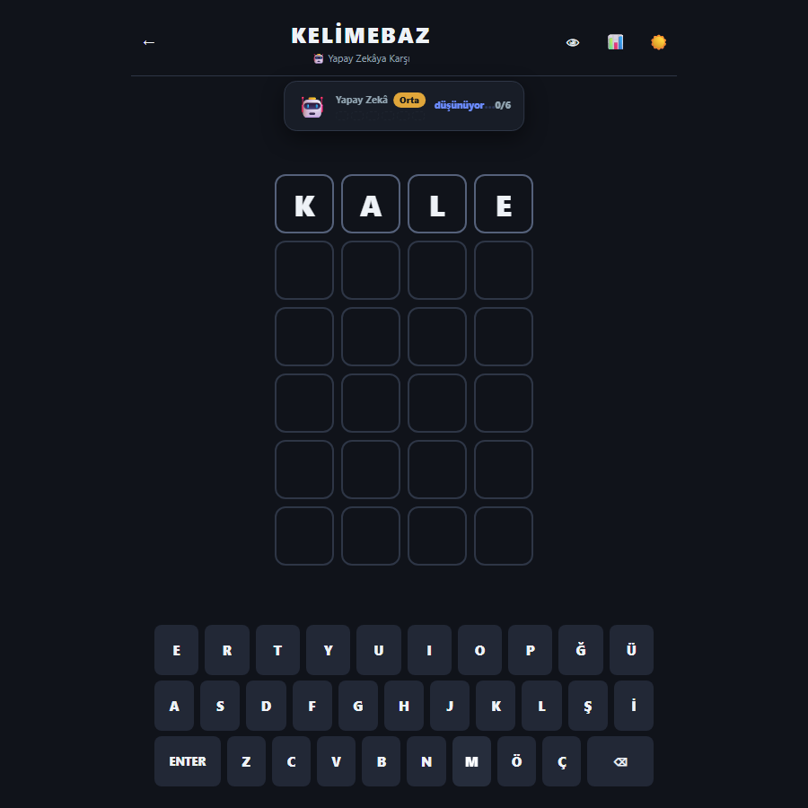
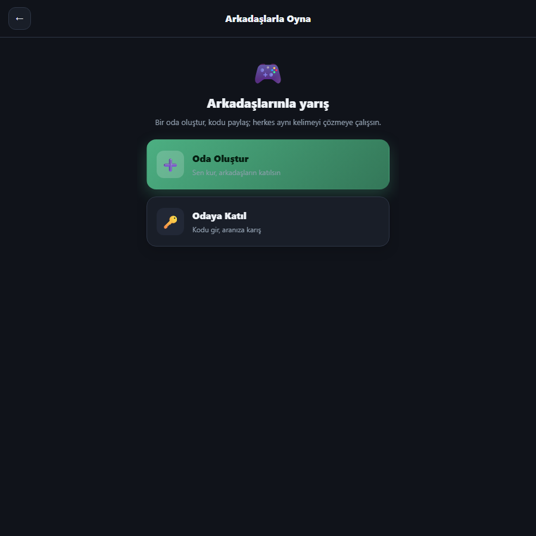
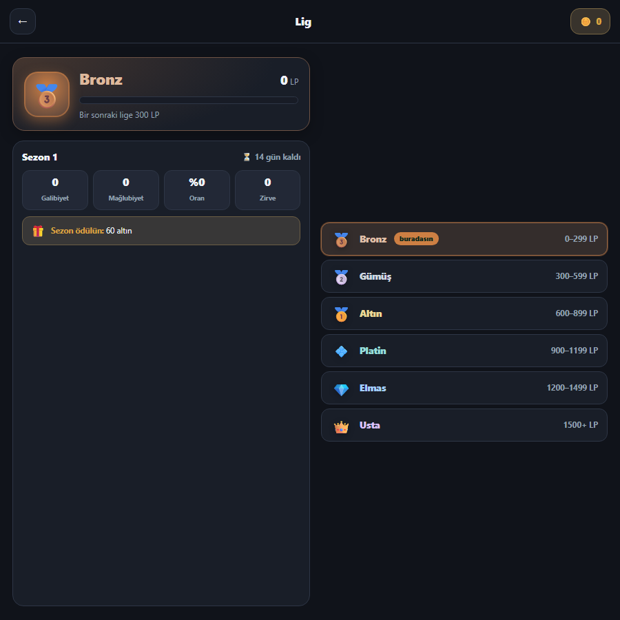

<div align="center">

# 🎯 Kelimebaz

**Türkçe kelime bulmaca oyunu.** Gizli kelimeyi 6 tahminde bul (kelime uzunluğu seviyene göre 4-7 harf).

### ▶️ [**Oyna: 34.158.136.9/berk/kelimebaz**](http://34.158.136.9/berk/kelimebaz/)



</div>

---

## Nasıl oynanır

Gizli kelimeyi tahmin et. Her tahminden sonra harfler renklenir:

| | Anlamı |
| --- | --- |
| 🟩 **Yeşil** | Harf doğru ve **doğru konumda** |
| 🟨 **Sarı** | Harf kelimede **var** ama yeri yanlış |
| ⬜ **Gri** | Harf kelimede **hiç yok** |

**6 hakkın var.** Kelime uzunluğu **seviyene göre 4-7 harf** arasında değişir. Bitmeden bulursan kazanırsın; bulamazsan doğru kelime gösterilir.

**Dört oyun modu:**
- 📅 **Günün Kelimesi** — herkes aynı kelimeyi oynar, her gün yenilenir, günde bir hak
- 🎲 **Serbest Oyna** — rastgele kelime, sınırsız
- 🎮 **Arkadaşlarla Oyna** — oda kur, kodla davet et, aynı kelimede yarış (sohbet + lider tablosu + süre sınırı)
- 🤖 **Yapay Zekâya Karşı** — bota karşı yarış, 3 zorluk (Kolay / Orta / Zor); ilk çözen kazanır

Ayrıca 🏆 **Lig**: günlük/serbest/oda maçları LP kazandırır, Bronz'dan Usta'ya yükselirsin, her sezon ödül dağıtılır. YZ modu casual'dır — ligi ve ana istatistikleri etkilemez.

---

## Ekran görüntüleri

| Ana menü | Oyun sonu |
| --- | --- |
|  |  |

| Profil sayfası | Ayarlar |
| --- | --- |
|  |  |

| Renk körü modu | Mobil |
| --- | --- |
|  |  |

| 🤖 Yapay zekâya karşı | 🎮 Çok oyunculu oda |
| --- | --- |
|  |  |

| 🏆 Lig | |
| --- | --- |
|  | |

---

## Özellikler

- 🤖 **Yapay zekâya karşı mod** — 3 zorluk (Kolay / Orta / Zor). Bot gerçek bir çözücüdür: renk ipuçlarıyla aday kelimeleri eleyerek yaklaşır. İlk çözen kazanır. Casual — ana istatistik/seriyi bozmaz
- 🎮 **Çok oyunculu oda** — oda kur, 4 haneli kodla davet et, aynı kelimede yarış. Sohbet, canlı lider tablosu, süre sınırı. Bağımsız Node sunucusu (`rooms-server/`)
- 🏆 **Lig sistemi** — maçlar LP kazandırır; Bronz → Gümüş → Altın → Platin → Elmas → Usta. 14 günlük sezonlar, sezon sonu ödülleri (altın + üst liglerde tema/rozet), yumuşak sıfırlama
- 🌍 **İngilizce dil desteği** — anlık dil değişimi (yeniden yükleme yok), ayrı TR/EN sözlükleri, İngilizce için ipucu sistemi
- 📚 **100.000+ kelimelik Türkçe sözlük** — 100.410 geçerli tahmin + 860 elle seçilmiş cevap (4-7 harf), çekimli biçimler dâhil (`GELDİ`, `OLSUN`, `ÜTÜYE`). İngilizce: 19.538 tahmin + 2.840 cevap
- 📏 **4-7 harf** — kelime uzunluğu oyuncu seviyesine göre artar (`core/word-length.ts`)
- 🎯 **Doğru renk mantığı** — harf tekrarlarında bile (Wordle klonlarının en sık hata yaptığı yer)
- ⌨️ **Tam Türk alfabesi** — 29 harf; `İ`/`I` ayrımı doğru. Türkçe klavyesi olmayanlar da `Ç Ğ Ö Ş Ü` yazabilir
- 📅 **Günün kelimesi** — tarihe göre deterministik, herkese aynı, geri sayımlı
- 📊 **İstatistikler** — oynanan, kazanma %, seri, tahmin dağılımı
- 🪙 **Altın** — oyun kazandıkça ve günlük görevleri bitirdikçe birikir
- 🛒 **Mağaza** — altınla tema, profil çerçevesi, rozet ve avatar satın alınır; kalıcı, istenince kullanılıp geri çıkarılır
- 📋 **Günlük görevler** — her gün yenilenir, tamamlayınca altın kazandırır
- 👤 **Profil sayfası** — fotoğraf, ad, **seviye**, puan, altın, bulunan kelime, seriler, tahmin dağılımı (tamamen yerel, hesap yok)
- 🎵 **Ses** — arka plan müziği + oyun içi efektler, **ayrı ayrı** ayarlanabilir ve kaydedilir
- ⚙️ **Ayarlar** — ses, tema, renk körü modu, veri sıfırlama
- 📋 **Spoiler'sız paylaşım** — 🟩🟨⬜ emoji ızgarası
- 🌙 **Karanlık + aydınlık tema** — sistem tercihine uyar
- 👁 **Renk körü modu** — mavi/turuncu palet
- ♿ **Erişilebilir** — sadece klavyeyle oynanabilir, ekran okuyucu her hamleyi okur
- 📱 **Responsive** — 320px'den 4K'ya
- 📲 **Kurulabilir + çevrimdışı (PWA)** — ana ekrana uygulama gibi eklenir, internetsiz de oynanır (günün kelimesi, serbest oyun, YZ). Yeni sürümde "Yenile" bildirimi. *(Kurulum/çevrimdışı için sunucu HTTPS gerektirir.)*
- 💾 **Kalıcı** — yarım oyun, istatistik ve tercihler `localStorage`'da
- 🧩 **Tek kişilik modlar backend'siz** — kelime listeleri JSON, tamamen istemci tarafı. Yalnızca çok oyunculu oda için hafif bir Node sunucusu var (`rooms-server/`)

---

## Kurulum

**Gereksinim:** Node.js **22.22.3+** veya **24.15.0+** (Angular 22 CLI şartı; daha eski sürümlerde derleme başlamaz).
Depo kökünde `.nvmrc` var — [nvm](https://github.com/nvm-sh/nvm) kullanıyorsan `nvm use` ile tek komutta doğru sürüme geçebilirsin.

```bash
git clone https://github.com/berk74988-ctrl/kelimebaz.git
cd kelimebaz
nvm use            # .nvmrc'deki desteklenen Node sürümüne geç (nvm kuruluysa)
npm install

npm start          # geliştirme sunucusu → http://localhost:4200
```

```bash
npm run build      # üretim derlemesi → dist/kelimebaz/browser/
npm test           # birim testler
```

---

## Teknoloji

**Angular 22** — standalone bileşenler (NgModule yok), **signals** ile durum yönetimi, `OnPush`, TypeScript, SCSS.

### Proje yapısı

```
src/app/
├── core/                    # SAF mantık — Angular'a bağımsız, kolay test edilir
│   ├── evaluate.ts          #   renk algoritması (oyunun kalbi)
│   ├── ai-opponent.ts       #   🤖 yapay zekâ çözücü (AiSolver)
│   ├── league.ts            #   🏆 lig: LP, kademeler, sezon ödülleri
│   ├── word-length.ts       #   📏 4-7 harf: seviyeye göre uzunluk
│   ├── lang.ts              #   🌍 dil türü + Türkçe/İngilizce yardımcıları
│   ├── messages.ts          #   🌍 tüm arayüz metinleri (tr + en)
│   ├── score.ts  level.ts   #   puan ve seviye (saf fonksiyonlar)
│   ├── gold.ts              #   altın ekonomisi
│   ├── quests.ts            #   günlük görev kayıt defteri
│   ├── shop-catalog.ts      #   mağaza kayıt defteri
│   ├── profile-stats.ts     #   profil istatistik kayıt defteri
│   ├── share.ts             #   emoji ızgarası
│   ├── a11y.ts              #   ekran okuyucu metinleri
│   ├── clipboard.ts         #   panoya kopyalama (HTTP yedekli)
│   └── turkish.ts           #   Türkçe büyük harf (i → İ)
├── components/              # standalone bileşenler
│   ├── board/  tile/  keyboard/  toast/  countdown/
│   ├── game/  title-screen/  error-screen/  guess-distribution/
│   ├── result-modal/  stats-modal/  stats-panel/  settings-modal/
│   ├── vsai-screen/         #   🤖 yapay zekâya karşı yarış
│   ├── room-screen/  room-chat/   # 🎮 çok oyunculu oda + sohbet
│   ├── league-screen/       #   🏆 lig tablosu, kademeler, sezon
│   ├── shop-screen/         #   🛒 mağaza
│   └── profile-screen/      #   👤 profil sayfası
├── services/                # durum ve kalıcılık (signals)
│   ├── game.service.ts      #   oyun akışı
│   ├── word.service.ts      #   kelime havuzu, günün kelimesi
│   ├── stats.service.ts     #   istatistikler (YZ ayrı sayaçta)
│   ├── league.service.ts    #   🏆 LP/sezon durumu
│   ├── room.service.ts      #   🎮 oda sunucusu istemcisi (polling)
│   ├── language.service.ts  #   🌍 anlık dil değişimi
│   ├── hint.service.ts      #   💡 ipucu sistemi
│   ├── gold.service.ts  quest.service.ts  inventory.service.ts
│   ├── profile.service.ts  audio.service.ts
│   ├── theme.service.ts     #   koyu/açık tema
│   └── contrast.service.ts  #   renk körü modu
├── models/game.model.ts     # TypeScript tipleri
└── data/
    ├── words.json           # TR CEVAPLAR — 860 (4-7 harf, 5 harfliler elle seçilmiş)
    ├── valid-words.json     # TR GEÇERLİ TAHMİNLER — 100.410
    ├── words-en.json        # EN CEVAPLAR — 2.840
    ├── valid-words-en.json  # EN GEÇERLİ TAHMİNLER — 19.538
    └── hints-tr.json  hints-en.json   # 💡 ipuçları (her biri 2.514)

rooms-server/                # 🎮 çok oyunculu oda sunucusu (bağımsız Node, repo kökünde)
```

### Mimari notlar

**Sözlük üç katmandan üretilir** (`scripts/build-dictionary.mjs`) — kelime **uydurulmaz**, hepsi ya insan eliyle yazılmış bir sözlükten gelir ya da gerçek metinde kanıtlanmıştır:

1. **Sözlük katmanı** — TDK tabanlı listeler + Zemberek + Hunspell + eş anlamlılar
2. **Vikisözlük katmanı** — madde başları (koşulsuz) + resmî çekim tabloları (sınanarak)
3. **Korpus katmanı** — OpenSubtitles frekans listesi, biçimbilim süzgecinden geçirilmiş

Üçüncü katman şart: kök sözlükleri `GEL` içerir ama oyuncu `GELDİ` yazar. Ham korpus ise çöp dolu (`FROST`, `MİKEY`, `ALDİM`), o yüzden süzülür.

`scripts/turkish-morph.mjs` her adayı çözümlemeye çalışır — kelime, bilinen bir kökten geçerli bir ekle, **ünlü uyumuna, sözcük türüne ve ek sırasına uyarak** türetilebiliyor mu?

| Aday | Karar | Neden |
| --- | --- | --- |
| `GELDİ` | ✅ | `GEL`(fiil) + `-di` — uyum doğru |
| `YOKTU` | ✅ | `YOK`(isim) + `-tu` — ek-fiil isme de gelir |
| `ÜTÜYE` | ✅ | Vikisözlük çekim tablosu: `ütü` + yönelme |
| `ALDİM` | ❌ | uyum bozuk (`AL` kalın → `ALDIM` olmalı) |
| `MORAN` | ❌ | `MOR` isim; `-an` yalnızca fiile gelir |
| `ÜVEZM` | ❌ | Vikisözlük şablon hatası (doğrusu `ÜVEZİM`) |
| `PETER` | ❌ | özel ad — Vikisözlük'ün `name` girdileri kara listede |
| `SİMDİ` | ❌ | `ŞİMDİ`nin yazım hatası (tek harf düzeltmesi çok daha sık) |

**Kelime ÜRETMEK denendi ve reddedildi.** Kuralları ileri yönde çalıştırıp her kökten her eki türetmek cazipti, ama isabeti %60-70'te tavan yaptı: kök listelerindeki `AB`, `ÖF`, `PO` gibi sahte parçalardan `ABIYI`, `ÖFSÜZ`, `POMDA` üretiyor; ek-fiil her isme gelebildiği için `JELDİ`, `ÇÖLÜZ` gibi dilbilgisel ama var olmayan kelimeler patlıyordu. Gerekçe `turkish-morph.mjs` içinde kayıtlı.

**Profil istatistikleri bir KAYIT DEFTERİNDEN çizilir** (`core/profile-stats.ts`). Şablonda kart tek tek yazılmaz; yeni bir istatistik eklemek için:

1. Gerekiyorsa `Stats`'a alanı ekle (`models/game.model.ts` + `EMPTY_STATS`)
2. Kayıt defterine bir satır ekle

Bitti — profil sayfası, boş durum ve testler kendiliğinden uyar. Eski kayıtlar göç kodu istemez: `StatsService.load()` eksik alanları varsayılanla tamamlar. Türetilmiş istatistikler (kazanma oranı gibi) `Stats`'ta **alan tutmaz**, kayıt defterinde hesaplanır — aynı sayıyı iki yerde saklamak, ikisinin zamanla ayrışması demektir.

**Puan ve seviye saf fonksiyonlar** (`core/score.ts`, `core/level.ts`). Puan: temel 100 + hız (kalan her hak +20) + seri (×5, en fazla +50). Her seviye bir öncekinden pahalı — `n → n+1` için `100 × n` puan.

**Altın ile puan AYRI para birimleri.** Puan seviye ilerlemesidir, harcanmaz. Altın (`core/gold.ts`) mağaza parasıdır, harcanır. İkisini karıştırmak — altını harcayınca seviyenin düşmesi — saçma olurdu. `GoldService.spend()` yetersiz bakiyede `false` döner ve kasaya dokunmaz; mağaza sadece bunu çağıracak.

**Günlük görevler bir KAYIT DEFTERİNDEN** (`core/quests.ts`) — istatistik kartları gibi. Yeni görev = deftere bir satır. Ödeme bir kez yapılır: tamamlanan görevin kimliği kaydedilir, sayfa yenilense de ikinci kez ödemez. Görevler her gün (oyuncunun yerel günü, günün kelimesiyle aynı ritim) sıfırlanır ama altın kalır.

**Mağaza da bir KAYIT DEFTERİNDEN** (`core/shop-catalog.ts`) — dört kategori (tema, çerçeve, rozet, avatar), her ürün bir satır. `InventoryService` sahipliği ve "kullanımda"yı yönetir; satın alma `GoldService.spend()`'e dayanır (yetersiz altında hiçbir şey değişmez), bir ürün iki kez alınamaz. Satın alınan kalıcıdır ve istenince kullanılıp geri çıkarılır. **Temalar** yalnızca `--accent`/`--accent-2`'yi `<html data-skin>` ile değiştirir; oyun durumu renklerine (WCAG ölçülü) ve paylaş butonuna dokunmaz, yani hiçbir tema okunabilirliği bozamaz. **Avatarlar tek sistem**: eski ücretsiz sekiz emoji de katalogda (fiyat 0), profil sadece envanterden okur.

**Renk mantığı `core/`'da, Angular'dan tamamen bağımsız.** İki geçişli algoritma:

1. Önce **tam isabetler** (🟩) işaretlenir ve o harfler cevabın havuzundan **düşülür**
2. Kalan harfler için havuzda hâlâ varsa 🟨, yoksa ⬜

Bu sıra sayesinde bir harf **asla iki kez sayılmaz**. Örnek — cevap `KALEM`, tahmin `ARABA`: tahminde 3 A var ama cevapta 1 A → **sadece biri** sarı olur.

Büyük-harfe çevirme **dile göredir** (`upperFor(s, lang)`); `evaluateGuess(guess, answer, lang)` bir `lang` parametresi alır (verilmezse `tr` — geriye dönük uyum). Böylece oyunun en kritik kuralı hiçbir yerde **sabit Türkçe** büyütme kullanmaz — yeni bir alfabe eklendiğinde (Almanca ß, aksanlı harfler) `i/İ/I` gibi kurallar renk sonucunu bozmaz.

**Renkler iki katmanlı:** `_variables.scss` (SCSS, derleme zamanı) → `:root` CSS değişkenleri (çalışma zamanı). Tema ve renk körü modu tek satır değişimiyle geçiş yapar — hiçbir bileşen yeniden çizilmez.

**Yapay zekâ rakip gerçek bir çözücüdür** (`core/ai-opponent.ts`) — Angular'dan bağımsız saf `AiSolver` sınıfı, doğrudan test edilir. Aynı gizli kelimeyi çözer: her tahminden gelen 🟩🟨⬜ desenine göre aday havuzunu eler (`evaluateGuess` ile), giderek yaklaşır. Zorluk iki koldan gelir: **hız** (düşünme aralığı — kolay yavaş, zor hızlı) ve **akıl** (`smart` 0..1 — filtrelenmiş adaydan tahmin etme olasılığı; düşükse ara sıra aday-dışı kelime deneyip tur harcar, yani daha zayıf oynar). Kolay ~18-27 sn'de, Zor ~8-11 sn'de çözer. YZ maçı **casual**tır: kazanma serisi/ana istatistik/lig **etkilenmez**, ayrı `vsaiPlayed`/`vsaiWon` sayaçlarında tutulur.

**Lig saf mantıktır** (`core/league.ts`) — LP, kademeler ve ödüller sinyal/DOM olmadan hesaplanır. Maç sonucu LP değiştirir: kazanınca `base + (7-tahmin)×2` (az tahmin → çok LP), kaybedince sabit düşüş; serbest mod puan çiftliğini önlemek için biraz daha az verir. LP eşikleri Bronz(0) → Gümüş(300) → Altın(600) → Platin(900) → Elmas(1200) → Usta(1500+). 14 günlük sezon sonunda ulaşılan lige göre ödül (altın + üst liglerde `theme.champion` / `badge.league`) verilir; yeni sezon **yumuşak sıfırlama** ile başlar (final LP'nin %35'i taşınır — sıfırdan başlamak cezalandırıcı olurdu).

**Dil anlık değişir** (`services/language.service.ts` + `src/i18n/{tr,en}.json`) — her dilin metinleri **ayrı bir JSON dosyasında** (düz `{ anahtar: metin }`, 435 anahtar). Varsayılan dil (`tr`) pakete **statik gömülüdür** (açılışta senkron gerekir, yükleme ekranı da metin ister); diğer diller **tembel indirilir** (dinamik `import('../../i18n/en.json')` → içerik-hash'li chunk). Dil değişince sayfa **yeniden yüklenmez** — `rev` sinyali artar, şablonlardaki `t()` yeniden hesaplanır. TR ve EN kendi kelime/geçerli-tahmin/ipucu sözlüklerine de sahiptir; oyun aktif dile göre doğru havuzdan (tembel indirilen chunk) seçer.

**Eksik anahtarda çökmez** — `t(key)` sırayla **aktif dil → varsayılan (tr) → anahtarın kendisi** diye düşer; bir dilde çeviri eksikse arayüz boş kalmaz, varsayılan dile döner. Tutarlılığı `npm run check:i18n` denetler (bir dilde olup diğerinde olmayan / boş anahtarları raporlar) ve bu kontrol **CI'da zorunludur** (`.github/workflows/ci.yml`) — eksik çeviriyle birleştirme engellenir.

**Yeni dil eklemek** (ör. Almanca `de`) — mimari buna hazır; adımlar:

1. **`core/lang.ts`** — `Lang` birliğine kodu ekle (`'tr' | 'en' | 'de'`) ve `upperFor()`'a o dilin büyük-harf kuralını yaz.
2. **`src/i18n/de.json`** — `tr.json`'u kopyala, değerleri Almanca'ya çevir (anahtarlar **aynı** kalmalı). `npm run check:i18n` ile eksik/fazla anahtar kalmadığını doğrula.
3. **`services/language.service.ts`** — `ensure()` içindeki tembel-yükleme koluna dili ekle (`lang === 'de' ? import('../../i18n/de.json') : …`). Varsayılan `tr` statik kalır; yeni diller tembel eklenir.
4. **Klavye düzeni** — o dilin alfabesi TR/EN'den farklıysa (ör. Almanca `Ä Ö Ü ß`) klavye bileşenindeki harf dizilimini o dile göre koşullandır (`components/keyboard`), `upperFor` kuralıyla tutarlı olsun.
5. **Veri dosyaları** (`src/app/data/`): `words-de.json` (cevap havuzu) + `valid-words-de.json` (geçerli tahminler). Üretim hattı: `scripts/build-dictionary.mjs` (o dilin sözlük/korpus kaynaklarıyla).
6. **Tembel yükleme** — `WordService.loadPool()`'a dil kolunu ekle (dinamik `import()`). İpucu/kart isteniyorsa `hints-de*.json` / `word-cards-de.json` + `HintService`/`WordCardService` kolları.
7. **YZ açılışları** — `scripts/build-ai-openers.mjs`'i çalıştır (o dilin havuzuyla `ai-openers.ts` üretilir).
8. **Renk mantığı** — **hiçbir değişiklik gerekmez.** `evaluateGuess` zaten `lang` alır ve `upperFor` kullanır; çağıranlar (GameService, AiSolver) aktif dili geçirir.

Kısaca: renk mantığı ve çözücü dilden bağımsız, çeviriler dil başına ayrı JSON'da — yeni dil eklemek yalnızca **veri + çeviri JSON'u + klavye düzeni + büyük-harf kuralı** işidir.

**Çok oyunculu oda `rooms-server/`'da** — ayrıntı için aşağıdaki bölüme bak. İstemci tarafı (`services/room.service.ts`) ~1.5 sn'de bir `GET /state` ile durumu çeker (polling; WebSocket yok → paylaşılan nginx'te dağıtımı sağlam).

**Kurulabilir + çevrimdışı (PWA)** — oyun ana ekrana **uygulama gibi kurulabilir** ve internetsiz oynanabilir (`@angular/service-worker` / ngsw).

- **Manifest** `public/manifest.webmanifest` (ad, kısa ad `Kelimebaz`, tema/arka plan `#10131a`, `display: standalone`, 192/512 px "any" + maskable ikonlar). İkonlar `public/favicon.svg`'den üretilir: `npm run build:icons` (playwright ile; logo değişirse yeniden çalıştır).
- **Önbellek stratejisi** `ngsw-config.json`: **uygulama kabuğu** (index, main, css, manifest, ikonlar) `prefetch` — kurulumda iner. **Sözlük/veri chunk'ları** ve müzik `lazy` — ilk kullanımda önbelleğe girer (ilk çevrimiçi oyundan sonra o mod çevrimdışı çalışır). **Oda API'si (`/berk/rooms/`) servis worker kapsamı DIŞINDA** (`/berk/kelimebaz/`) → hiç önb: doğrudan ağ.
- **Çevrimdışı**: Günün Kelimesi · Serbest Oyna · YZ'ye Karşı çalışır; **oda modu kapatılır** ve nedeni gösterilir (`PwaService.online` → `navigator.onLine`; `title-screen`'de buton devre dışı).
- **Güncelleme akışı**: yeni sürüm yayınlanınca ngsw indirir, `PwaService` (SwUpdate) "Yeni sürüm hazır → Yenile" çubuğunu gösterir (`components/pwa-prompt`).
- **Kurulum istemi**: `beforeinstallprompt` yakalanır, "ana ekrana ekle" **ancak 2. oyundan sonra** ve tek "Şimdi değil"le kalıcı kapanır (ısrarcı değil).
- **Deploy**: `kb-deploy.sh` artık `manifest.webmanifest` + `ngsw-worker.js` + `ngsw.json` + `icons/` + `music.mp3`'ü de kopyalar. **ngsw.json listelediği HER dosyayı prod'da bulmalı** — yeni bir statik dosya eklenince deploy'a da eklenmeli.
- ⚠️ **HTTPS şart**: servis worker ve "ana ekrana ekle" yalnızca **güvenli bağlamda** (HTTPS veya `localhost`) çalışır. Düz HTTP'de (`http://34.158.136.9/...`) SW kaydolmaz — kod zarar vermez, sessizce devre dışı kalır; site normal çalışır. Kurulum/çevrimdışı için sunucuya HTTPS (alan adı + Let's Encrypt ya da Cloudflare Tunnel) gerekir. Doğrulama `localhost`'ta yapıldı (SW aktif, manifest geçerli, uçak modunda kabuk + oyun açıldı).

---

## Çok oyunculu oda sunucusu (`rooms-server/`)

"Arkadaşlarla Oyna" modunun arkasındaki küçük backend. **Bağımlılıksız, saf Node HTTP** (`rooms-server/server.js`, ~330 satır) — Express yok, veritabanı yok. Oda durumu **bellekte** tutulur (`Map`); süreç yeniden başlarsa aktif odalar sıfırlanır (arkadaş yarışı için kabul edilebilir).

**Ne yapar:** oda oluşturma (4 haneli kod), katılma, aynı kelimede yarış, sohbet, canlı skor/lider tablosu, süre sınırı. Gerçek zamanlılık **kısa aralıklı sorgulama** ile sağlanır (istemci ~1.5 sn'de bir `GET /state`) — WebSocket yok, çünkü paylaşılan nginx'te upgrade yapılandırması gerektirmez ve dağıtımı çok daha sağlamdır.

**Uç noktalar:** `POST /create · /join · /start · /score · /ready · /settings · /chat · /leave` ve `GET /state`, `GET /health`.

**Çalıştırma (yerel):**
```bash
cd rooms-server
node server.js               # varsayılan PORT=4243, HOST=127.0.0.1
curl localhost:4243/health   # {"ok":true}
```

**Yayına alma (systemd + nginx):**
```bash
# 1) Servis olarak çalıştır (yeniden başlatmada da ayakta)
sudo cp rooms-server/berk-rooms.service /etc/systemd/system/
sudo systemctl enable --now berk-rooms

# 2) nginx'e /berk/rooms/ -> 127.0.0.1:4243 proxy yolunu GÜVENLE ekle
#    (yedek alır, ekler, `nginx -t` ile doğrular, test başarısızsa geri yükler)
sudo python3 rooms-server/nginx_add_rooms.py
```
Sunucu yalnızca `127.0.0.1`'de dinler — internete doğrudan açık değildir, dışarıya **aynı köken** üzerinden nginx `/berk/rooms/` yolu açar (backend maruz kalmaz). Bellek koruması: en fazla 500 oda, 3 saat hareketsizlikte oda silinir, mesaj/uzunluk sınırları var.

---

## Test

```bash
npm test                     # 367 birim test
npm run check:scenarios      # 22 uçtan uca senaryo × 3 tarayıcı
npm run check:profile        # profil sayfası, seviye, fotoğraf, kalıcılık
npm run check:gold           # altın kazancı, günlük görevler, kalıcılık
npm run check:shop           # satın alma, kullanma, tema uygulaması, kalıcılık
npm run check:audio          # müzik, efektler, ses ayarları, kalıcılık
npm run check:dictionary     # 29 harf + sözlük kabul/ret (gerçek tarayıcı)
npm run check:responsive     # 8 ekran boyutu
npm run check:a11y           # klavye + ekran okuyucu + odak
npm run check:contrast       # WCAG kontrast (4 mod)
npm run check:share          # panoya kopyalama
```

Tüm kontroller hem yerelde hem **canlı sitede** çalıştırılıyor. Ayrıntılı checklist ve bulunan hatalar: **[TESTING.md](TESTING.md)**

| Katman | Sonuç |
| --- | --- |
| Birim testler (33 dosya) | ✅ 367/367 |
| Senaryolar (Chromium + Firefox + WebKit) | ✅ 66/66 |
| Ses · Harf + sözlük · Responsive · Erişilebilirlik · Kontrast · Paylaşım | ✅ |

---

## Deploy

Üretim derlemesi statik dosyalardan ibaret — herhangi bir statik barındırmaya konabilir.

```bash
npm run build
# dist/kelimebaz/browser/ içeriğini sunucuya kopyala
```

Alt klasöre kuruluyorsa `base-href` gerekir. Bu proje `/berk/kelimebaz/` altında yayında, bu yüzden `angular.json`'ın **production** yapılandırmasına gömülü:

```json
"baseHref": "/berk/kelimebaz/"
```

Böylece düz `ng build` her zaman doğru yolu üretir.

---

## Yol haritası

- [x] Oyun tahtası, Türkçe klavye, renk mantığı
- [x] Kazanma / kaybetme, geçersiz kelime uyarıları
- [x] Animasyonlar, responsive, karanlık mod
- [x] İstatistikler, günün kelimesi, paylaşım
- [x] Erişilebilirlik ve renk körü modu
- [x] Uçtan uca test takımı, canlı deploy
- [x] Sözlüğü genişlet (205 → 5.520 kelime)
- [x] Giriş menüsünü yenile (hareketli arka plan, mod kartları)
- [x] Biçimbilim süzgeci + çekimli biçimler (5.520 → 12.581 kelime)
- [x] Ana menü: cam panel, profil + ayarlar, istatistik kartları
- [x] Oyun sonu ekranı: kart hâlinde istatistikler, okunur dağılım, büyük butonlar
- [x] Ses: arka plan müziği + WebAudio efektleri, ayrı ses ayarları
- [x] Değişken kelime uzunluğu (4-7 harf, seviyeye göre)
- [x] Sözlüğü büyüt (12.581 → 100.410 geçerli tahmin)
- [x] Mağaza: tema, çerçeve, rozet, avatar (kayıt defteri) + altın ekonomisi
- [x] Yapay zekâya karşı mod — 3 zorluk, gerçek çözücü, casual (ana ilerlemeyi bozmaz)
- [x] Çok oyunculu oda — bağımsız Node sunucusu, kod/sohbet/lider tablosu/süre
- [x] Lig sistemi — LP, kademeler, 14 günlük sezon, sezon ödülleri
- [x] İngilizce dil desteği — anlık geçiş, ayrı sözlükler, ipucu sistemi
- [ ] Müzik dosyasını sıkıştır (şu an 4 MB — `ffmpeg` gerekiyor)
- [ ] HTTPS (özel alan adı)
